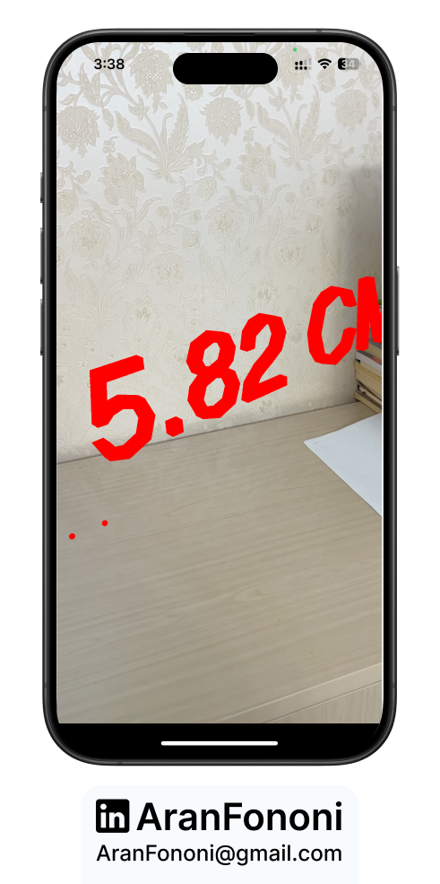
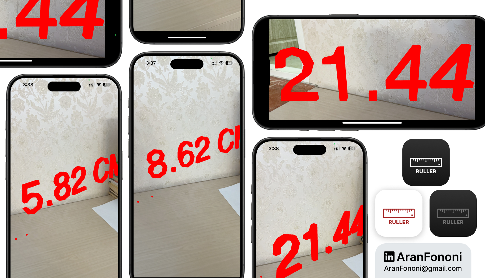

# AR Ruler 📏

### Section 28: Augmented Reality Ruler App

**AR Ruler** is an iOS app developed using ARKit to measure real-world distances by placing virtual points in the environment. This project demonstrates how augmented reality can be leveraged to create an interactive measurement tool.

## Project Overview
The app enables users to place two points in their surroundings, displaying the calculated distance in real-time. The app highlights ARKit’s raycasting capabilities to interact with horizontal planes for accurate measurement.

## Learning Outcomes
- **Raycasting with ARKit**: Enhanced understanding of placing virtual nodes accurately within the real world using raycast queries.
- **Geometry Manipulation in SceneKit**: Learned to create and manipulate SCNNode objects and display custom measurements.
- **Text Nodes for Measurement**: Gained experience with displaying real-time text labels for feedback on user actions.

## Key Skills
- Raycasting and hit-testing for point placement
- Real-time distance calculation between two points
- SceneKit geometry manipulation and text nodes

## Additional Features
- **Dynamic Measurement Updates**: The app automatically recalculates distance with each new measurement.
- **Customizable Visual Feedback**: Red spheres are used as markers, and measurement is displayed as an overlay above the second point.

---

### Project Preview

---

### Footer

---

## Contact
For more information, feel free to reach out:  
- **Email**: [aranfononi@gmail.com](mailto:aranfononi@gmail.com)  
